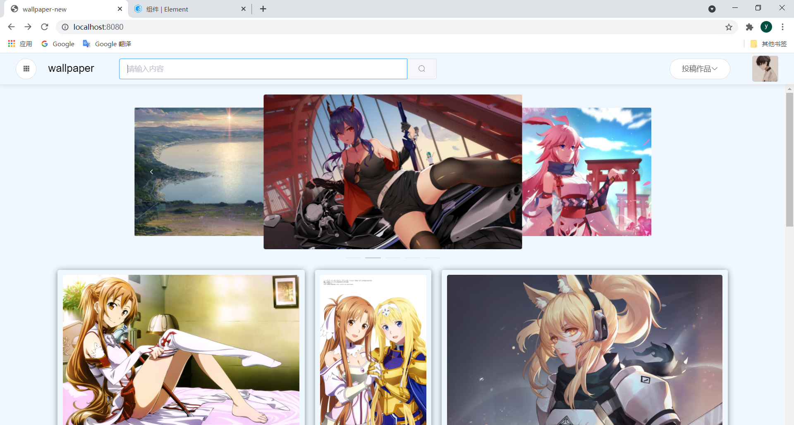
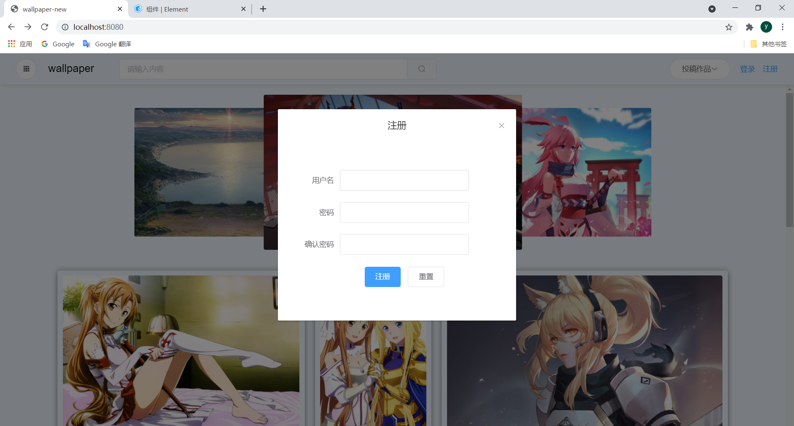
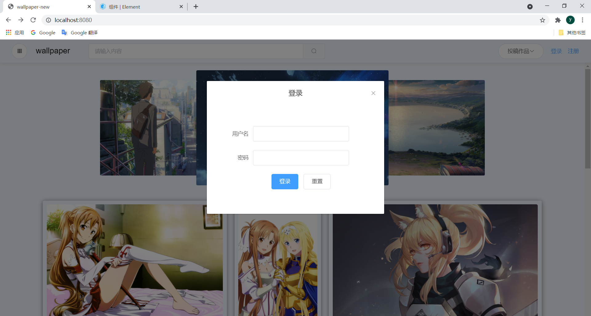
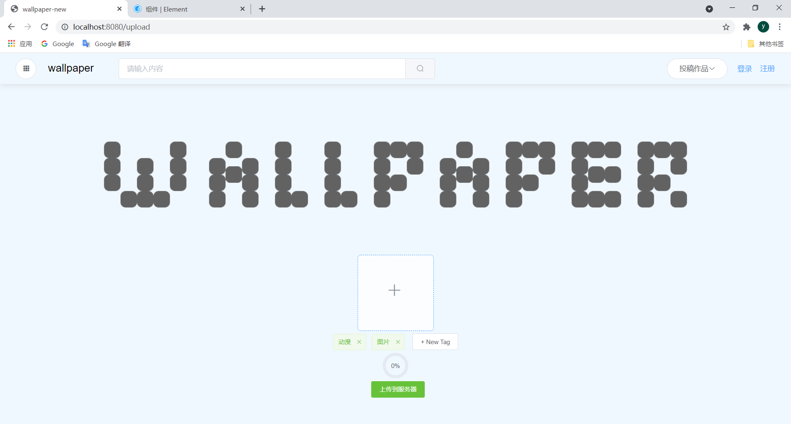

# 基于SpringBoot，Vue，Element Ui 前后端分离的简单壁纸网站

## 基本介绍

目前只做了部分功能，有待后续跟新

## 软件版本

- IDEA 2020.3.2
- JDK1.8
- vue 2.9.6
- mysql 5.5.40

## 效果展示

## 功能

目前实现了上传登录注册等功能

### 注册

### 登录

### 上传图片

上传图片运用了阿里云的OSS对象存储，详情请上阿里云查考API

